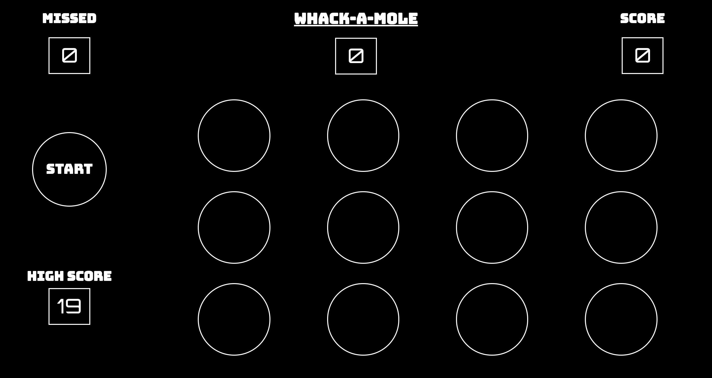

# Whack-A-Mole

## Description and Background
Based on the classic carnival game, Whack-A-Mole features three exhilirating levels of mole-whacking fun! Click the moles as they pop up to whack them with your mallet. 

Every mole you hit adds one to your score, but be careful, because the moles will burrow back down if you don't whack them in time, and the game speeds up as the timer progresses!

In later levels, the game will get more challenging by throwing two and three moles your way at once.

## Technologies Used

This game was build using HTML, CSS, and JavaScript utilizing the jQuery library for DOM manipulation.

Additionally, I used [Autoprefixer](https://autoprefixer.github.io/) to optimize my CSS for all browsers, since CSS Grid and Flexbox are not yet universally supported.

## Getting Started

To start, just click the Start button. The timer will begin counting down, and the moles will start popping up. When the timer reaches zero, the level is over, and the Start button will display which one comes next. Click that button to play the next level. 

After three levels, the Start button will change to "Play Again", which you can click to try the game again.

And, since your high scores are saved by the browser's localStorage object, you can come back at any time and try to beat your best result.

## Next Steps

Given more time, I would like to add a final fourth boss level, featuring a Super Mole that take multiple whacks to defeat.

## Rights Documentation

All sounds and images are either public domain or licensed under Creative Commons.

__Audio Sources__

#####01-popup.mp3

https://freesound.org/people/pan14/sounds/263133/

#####02-mallet-whack.mp3

https://freesound.org/people/timgormly/sounds/170141/

#####03-dull-whack.mp3

https://freesound.org/people/worthahep88/sounds/319217/

#####04-start-bell.mp3

https://freesound.org/people/CapsLok/sounds/184438/

#####05-start-bell.mp3

https://freesound.org/people/harrietniamh/sounds/415083/

###Image Sources

#####mallet-up.png and mallet-down.png

https://svgsilh.com/image/1278401.html
https://creativecommons.org/publicdomain/zero/1.0/

#####mole.png

https://openclipart.org/detail/168496/cartoon-mole
https://openclipart.org/share

## Citations

The game is optimized for mobile, and works best in portrait mode. In order to display "Please Adjust Your Screen" while in landscape mode, I used the fundamentals described in the article below:

[https://code-boxx.com/lock-screen-orientation/](https://code-boxx.com/lock-screen-orientation/)
